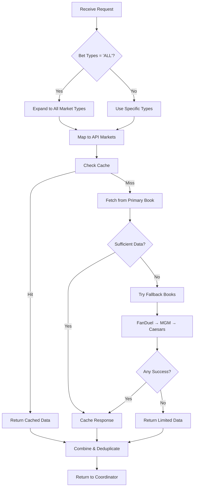
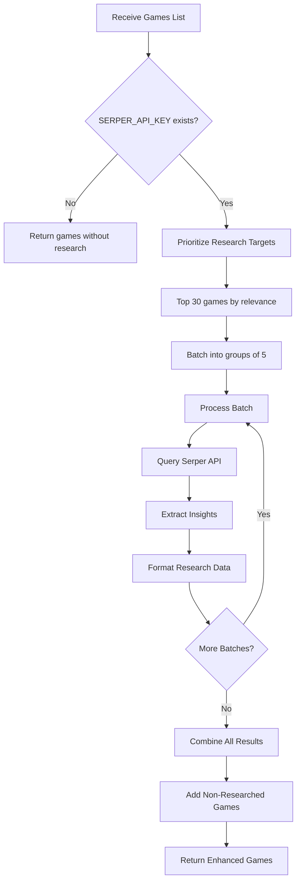
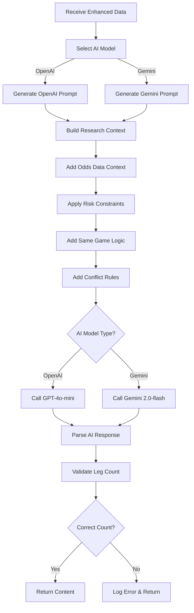

# Cray Cray Parlay App - Agentic AI Flow Diagram

## 🤖 **Multi-Agent AI System Flow**

```mermaid
graph TD
    subgraph "User Input Layer"
        A[User Request] --> B{Validate Input}
        B --> C[Sports: NFL, NBA, etc.]
        B --> D[Bet Types: ALL, Spreads, Props]
        B --> E[Risk Level: Low/Med/High]
        B --> F[Legs: 3-10 count]
        B --> G[Sportsbook: DraftKings, etc.]
    end
    
    subgraph "Multi-Agent Coordinator"
        H[MultiAgentCoordinator] --> I[Phase 1: Data Collection]
        H --> J[Phase 2: Research Enhancement]
        H --> K[Phase 3: AI Generation]
        H --> L[Phase 4: Validation]
        H --> M[Phase 5: Quality Assurance]
    end
    
    subgraph "Phase 1: TargetedOddsAgent"
        N[TargetedOddsAgent] --> O[Expand 'ALL' Bet Types]
        N --> P[Fetch Primary Sportsbook]
        N --> Q[Apply Fallback Logic]
        N --> R[Cache & Deduplicate]
        N --> S[Batch Prop Markets]
        
        O --> O1[Moneyline/Spread]
        O --> O2[Totals O/U]
        O --> O3[Player Props]
        O --> O4[TD Props]
        O --> O5[Team Props]
        
        P --> P1[DraftKings Primary]
        Q --> Q1[FanDuel Fallback]
        Q --> Q2[MGM Fallback]
        Q --> Q3[Caesars Fallback]
        
        R --> R1[5-min Cache TTL]
        R --> R2[Pending Request Track]
        
        S --> S1[3 Markets per Call]
        S --> S2[Reduce API Usage]
    end
    
    subgraph "Phase 2: EnhancedResearchAgent"
        T[EnhancedResearchAgent] --> U[Prioritize Research Targets]
        T --> V[Batch Processing]
        T --> W[Comprehensive Analysis]
        
        U --> U1[Top 30 Games]
        U --> U2[Recent Form Priority]
        
        V --> V1[5 Concurrent Requests]
        V --> V2[API Quota Management]
        
        W --> W1[Injury Reports]
        W --> W2[Team Trends]
        W --> W3[Head-to-Head Data]
        W --> W4[Weather Conditions]
    end
    
    subgraph "Phase 3: ParlayAnalyst"
        X[ParlayAnalyst] --> Y[Generate AI Prompt]
        X --> Z[Risk Level Constraints]
        X --> AA[Same Game Parlay Logic]
        X --> BB[Conflict Prevention]
        
        Y --> Y1[OpenAI GPT-4o-mini]
        Y --> Y2[Gemini 2.0-flash]
        
        Z --> Z1[Low: 8-9/10 confidence]
        Z --> Z2[Med: 6-9/10 confidence]
        Z --> Z3[High: 3-9/10 confidence]
        
        AA --> AA1[Multiple bet types same game]
        AA --> AA2[Player prop variety]
        AA --> AA3[Market type mixing]
        
        BB --> BB1[No opposing sides]
        BB --> BB2[No redundant props]
        BB --> BB3[No ML + spread same team]
    end
    
    subgraph "External AI APIs"
        CC[OpenAI API] --> DD[GPT-4o-mini Model]
        EE[Gemini API] --> FF[2.0-flash Model]
        
        DD --> DD1[Temperature: 0.3]
        DD --> DD2[Max Tokens: 3500]
        DD --> DD3[System Prompt Enhanced]
        
        FF --> FF1[Temperature: 0.3]
        FF --> FF2[Max Output: 3500]
        FF --> FF3[Generation Config]
    end
    
    subgraph "Phase 4: Validation Engine"
        GG[Validation Engine] --> HH[Same Game Conflict Check]
        GG --> II[Date Accuracy Validation]
        GG --> JJ[Odds Calculation]
        GG --> KK[Leg Count Verification]
        
        HH --> HH1[Detect opposing bets]
        HH --> HH2[Flag redundant picks]
        
        II --> II1[Extract game dates]
        II --> II2[Validate against data]
        
        JJ --> JJ1[American to Decimal]
        JJ --> JJ2[Combined Odds Calculation]
        JJ --> JJ3[Payout Calculation]
        
        KK --> KK1[Count generated legs]
        KK --> KK2[Match user request]
    end
    
    subgraph "Phase 5: Quality Assurance"
        LL[Quality Assurance] --> MM[Content Formatting]
        LL --> NN[Metadata Generation]
        LL --> OO[Final Response]
        
        MM --> MM1[Fix odds calculations]
        MM --> MM2[Format consistency]
        MM --> MM3[Research integration]
        
        NN --> NN1[Processing time]
        NN --> NN2[Data quality score]
        NN --> NN3[Source tracking]
        
        OO --> OO1[Main parlay]
        OO --> OO2[Bonus lock parlay]
        OO --> OO3[Strategy notes]
    end
    
    C --> H
    D --> H
    E --> H
    F --> H
    G --> H
    
    I --> N
    J --> T
    K --> X
    L --> GG
    M --> LL
    
    N --> T
    T --> X
    X --> CC
    X --> EE
    CC --> GG
    EE --> GG
    GG --> LL
    LL --> PP[Final Response to User]
    
    style H fill:#ff9800
    style N fill:#2196f3
    style T fill:#4caf50
    style X fill:#9c27b0
    style GG fill:#f44336
    style LL fill:#607d8b
```



## 🔄 **Detailed AI Agent Workflows**

### **1. TargetedOddsAgent Workflow**


### **2. EnhancedResearchAgent Workflow**


### **3. ParlayAnalyst AI Generation Workflow**


## 🧠 **AI Prompt Engineering Architecture**

### **Prompt Structure Hierarchy**
```
AI Prompt Architecture
├── System Context
│   ├── Role Definition (Sharp sports bettor)
│   ├── Task Specification (Create X-leg parlay)
│   └── Data Constraints (Use only provided data)
├── Critical Requirements
│   ├── Exact Leg Count (NON-NEGOTIABLE)
│   ├── Same Game Strategy (Multiple bet types)
│   ├── Conflict Prevention (Clear rules)
│   └── Research Integration (Specific insights)
├── Data Context
│   ├── Odds Data (Formatted games & markets)
│   ├── Research Insights (Injuries, trends)
│   ├── User Preferences (Risk, sports, books)
│   └── Available Markets (Expanded from 'ALL')
├── Validation Checklist
│   ├── Leg Count Verification
│   ├── Conflict Detection
│   ├── Research Citation
│   └── Confidence Levels
└── Output Format
    ├── Structured Parlay Format
    ├── Research Summary
    ├── Bonus Lock Parlay
    └── Strategy Explanation
```

### **Risk Level AI Constraints**
```
Risk Level Intelligence
├── Low Risk (8-9/10 confidence)
│   ├── Heavy favorites only
│   ├── Strong research support required
│   ├── Conservative lines preferred
│   └── High probability outcomes
├── Medium Risk (6-9/10 confidence)
│   ├── Balanced risk/reward
│   ├── Mix of favorites and underdogs
│   ├── Solid research backing
│   └── Moderate probability spread
└── High Risk (3-9/10 confidence)
    ├── Contrarian plays allowed
    ├── Higher variance acceptable
    ├── Aggressive lines welcome
    └── Lower probability, higher payout
```

## 📊 **AI Performance Monitoring**

### **Quality Metrics Tracking**
```
AI Output Quality Metrics
├── Leg Count Accuracy
│   ├── Requested vs Generated
│   ├── Success Rate by Model
│   └── Failure Pattern Analysis
├── Conflict Detection
│   ├── Same Game Conflicts Found
│   ├── Opposing Bet Detection
│   └── Redundant Prop Identification
├── Research Integration
│   ├── Citations per Reasoning
│   ├── Generic vs Specific Analysis
│   └── Research Quality Score
└── User Satisfaction
    ├── Preference Adherence
    ├── Risk Level Compliance
    └── Sportsbook Selection Accuracy
```

### **Model Performance Comparison**
```
OpenAI vs Gemini Analysis
├── Response Time
├── Instruction Following
├── Research Integration
├── Creativity & Insights
├── Conflict Avoidance
├── Leg Count Compliance
└── Overall Quality Score
```