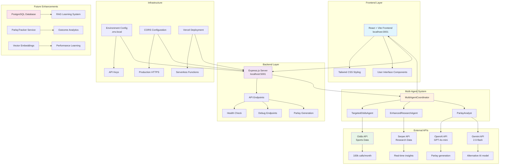
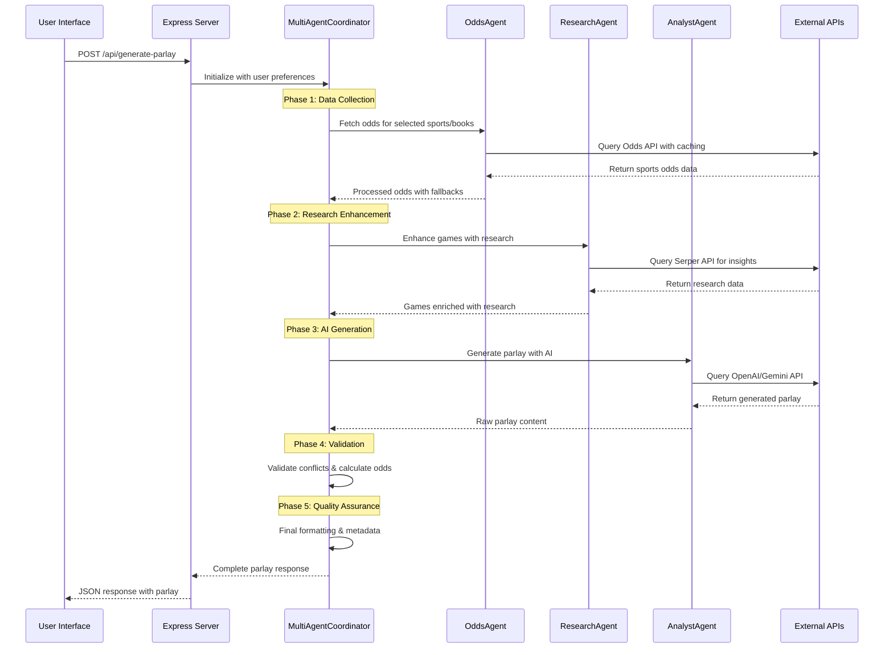

# Cray Cray Parlay App - System Architecture

## 📱 **High-Level System Architecture**



## 🏗️ **Detailed Component Architecture**

### **Frontend Components**
```
React App (Vite)
├── src/
│   ├── App.jsx (Main application)
│   ├── main.jsx (Entry point)
│   ├── index.css (Global styles)
│   └── assets/ (Static resources)
├── Tailwind CSS (Styling framework)
├── Vite Config (Build tool)
└── Proxy to localhost:5001 (API communication)
```

### **Backend Structure**
```
Express.js Server
├── server.js (Main server file)
├── api/
│   ├── generate-parlay.js (Main endpoint)
│   ├── health.js (Health checks)
│   ├── debug-odds.js (Debug utilities)
│   └── agents/ (Multi-agent system)
├── scripts/ (Utility scripts)
├── services/ (Business logic)
└── database/ (Schema & models)
```

### **Multi-Agent System**
```
MultiAgentCoordinator
├── Phase 1: Data Collection (TargetedOddsAgent)
├── Phase 2: Research Enhancement (EnhancedResearchAgent)  
├── Phase 3: AI Generation (ParlayAnalyst)
├── Phase 4: Validation & Odds Calculation
└── Phase 5: Quality Assurance & Formatting
```

## 🔄 **Data Flow Architecture**



## 🚀 **Deployment Architecture**

### **Development Environment**
```
Local Development
├── Frontend: localhost:3001 (Vite dev server)
├── Backend: localhost:5001 (Express server)
├── Environment: .env.local (API keys)
├── CORS: Enabled for local development
└── Hot Reload: Both frontend and backend
```

### **Production Environment**
```
Vercel Deployment
├── Frontend: Static React build
├── Backend: Serverless functions (/api/*)
├── Environment: Vercel environment variables
├── CORS: Configured for production domains
├── HTTPS: Automatic SSL certificates
└── CDN: Global content delivery
```

## 🔧 **Configuration Architecture**

### **Environment Management**
```
Environment Variables
├── .env.local (Local development)
├── .env (Fallback configuration)
├── API Keys:
│   ├── ODDS_API_KEY (Sports data)
│   ├── SERPER_API_KEY (Research)
│   ├── OPENAI_API_KEY (AI generation)
│   └── GEMINI_API_KEY (Alternative AI)
└── Configuration:
    ├── NODE_ENV (Environment detection)
    └── FRONTEND_URL (CORS configuration)
```

### **Build Configuration**
```
Build Tools
├── Vite (Frontend bundling)
├── Tailwind CSS (Utility-first styling)
├── ESLint (Code quality)
├── PostCSS (CSS processing)
└── Package.json (Dependencies & scripts)
```

## 📊 **Performance & Monitoring**

### **Optimization Features**
```
Performance Optimizations
├── Response Caching (5-minute TTL)
├── Request Deduplication
├── Prop Market Batching (3 markets/call)
├── API Rate Limiting
├── Fallback Sportsbook Logic
└── Error Handling & Retry Logic
```

### **Monitoring Endpoints**
```
Health & Debug
├── /health (System status)
├── /debug/odds-test (API connectivity)
├── Environment validation
├── API key verification
└── Performance metrics
```