# Enhanced AI Agent Architecture - Cray Cray Parlay App

## 🏗️ Complete Multi-Agent System Architecture

## 🔄 Enhanced Agentic Flow Process

### **Phase 1: User-Driven Odds Acquisition**

### **Phase 2: Research Enhancement**

### **Phase 3: Intelligent Analysis with Retry**

## 🎯 Agent Specializations & Responsibilities

### **1. MultiAgentCoordinator**

**Key Features:**
- **5-Phase Workflow Management**
- **Retry Mechanism** (up to 3 attempts)
- **Leg Count Validation**
- **Quality Assurance**
- **Performance Monitoring**

### **2. TargetedOddsAgent**

**Key Features:**
- **"ALL" Bet Type Expansion** to all available markets
- **Response Caching** (5-minute TTL)
- **Request Deduplication**
- **Prop Market Batching** (3 markets per call)
- **Smart Fallback Logic**

### **3. EnhancedResearchAgent**

**Key Features:**
- **Real-time Research** via Serper API
- **Injury Report Integration**
- **Performance Trend Analysis**
- **Contextual Game Analysis**
- **Data Enrichment Pipeline**

### **4. ParlayAnalyst (Enhanced)**

**Key Features:**
- **Win Probability Prioritization** over flashy odds
- **Intelligent Conflict Prevention**
- **Same-game Parlay Mastery**
- **Risk-appropriate Selection Strategies**
- **Dynamic Prompt Engineering**

## 🔍 Conflict Detection & Resolution

### **Conflict Prevention Matrix**

```mermaid
graph TB
    subgraph "❌ FORBIDDEN CONFLICTS"
        REDUND[Redundant Bets<br/>Eagles ML + Eagles Spread]
        OPPOSE[Opposing Sides<br/>Eagles -7 + Giants +7]
        TOTAL[Conflicting Totals<br/>Over 47.5 + Under 47.5]
        PROP[Conflicting Props<br/>Hurts Over/Under 250 yards]
        DUPE[Duplicate Bets<br/>Same exact bet twice]
    end
    
    subgraph "✅ SMART COMBINATIONS"
        SAMEGAME[Same Game Different Types<br/>Eagles -7 + Over 47.5 + Hurts yards]
        MULTIGAME[Different Games<br/>Eagles -7 + Cowboys ML + Bills Over]
        PLAYERS[Multiple Players<br/>Hurts + Saquon + Brown + Smith]
        MARKETS[Different Markets<br/>Game total + Team total + Props]
    end
```

## 📊 Win Probability Strategy by Risk Level

### **Risk-Appropriate Selection Framework**

## 🔄 Retry & Validation Workflow

### **Quality Assurance Pipeline**

## 🚀 Performance Optimizations

### **System Efficiency Features**
- **Response Caching** - 5-minute TTL for odds data
- **Request Deduplication** - Avoid duplicate API calls
- **Prop Market Batching** - 3 markets per API call
- **Smart Fallbacks** - Multiple sportsbook options
- **Retry Mechanism** - Up to 3 attempts for quality
- **Conflict Pre-filtering** - Prevent invalid combinations

### **API Efficiency Metrics**
- **Odds API**: 100k calls/month with optimization
- **Serper API**: Real-time research integration  
- **OpenAI/Gemini**: Lower temperature (0.3) for consistency
- **Cache Hit Rate**: Target 70%+ for repeated requests
- **Response Time**: < 10 seconds for complex parlays

## 📈 Quality Monitoring

### **Success Metrics**
- **Leg Count Accuracy**: 100% (via retry mechanism)
- **Conflict Prevention**: 0 invalid combinations
- **Research Integration**: 90%+ legs with research context
- **Risk Compliance**: Selections match risk tolerance
- **Win Probability Focus**: Prioritized over flashy odds

This enhanced architecture represents a sophisticated multi-agent system that prioritizes **win probability**, implements **intelligent retry mechanisms**, and provides **comprehensive quality assurance** while maintaining the flexibility to support both same-game and multi-game parlay strategies.