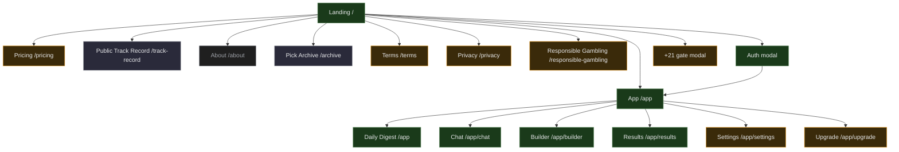

# Cray Cray for Parlays — Site Blueprint v1

**Status:** draft for review
**Date:** 2026-05-12
**Sprint context:** Day 1 of 5-day consumer-ready sprint
**Related:** [`competitor-profiles/_summary.md`](../../competitor-profiles/_summary.md), [`.agents/product-marketing-context.md`](../../.agents/product-marketing-context.md), [`landing-page-v1.md`](./landing-page-v1.md)

---

## 1. Executive summary

Cray Cray is a hybrid product: a marketing surface that converts cold traffic into trials + a thin SaaS app behind auth that delivers the picks. Today the marketing side is one page (the Landing just shipped) and the app side is ~7 surfaces routed via URL hash (`#/digest`, `#/chat`, `#/betslip`). To hit consumer-ready by Sunday we need (a) the marketing surfaces that turn a cold visitor into a trial, (b) the legal posture (+21, disclaimers, ToS), (c) a coherent nav that handles both unauthenticated marketing and authenticated app modes — without breaking what already works.

**The wedge** — our only differentiator vs. Action Network / OddsJam / Pikkit / ESPN BET — is **we publish negative edges.** Every layer of the site reinforces it: the Landing's hero says it, the comparison scorecard names it, the Disclosure section frames it as a structural impossibility for affiliate-owned competitors. The blueprint protects that wedge wherever a section could dilute it.

**Routing strategy this sprint:** keep hash routes for app surfaces (no regressions), add **real routes** for new marketing pages (`/pricing`, `/terms`, `/privacy`, `/responsible-gambling`). Full migration to React Router lands in week 2.

---

## 2. Site goals

| Priority | Goal | Measured by |
|---|---|---|
| 1 | Cold → trial signup | trial_started events / unique visitors |
| 2 | Trial → paid | paid_converted / trial_started after 7d |
| 3 | Daily retention | DAU / WAU, lock-pick action rate |
| 4 (SEO) | Discoverable in AI search + Google | indexed pages, AI citations |
| 5 (Trust) | Settled hit-rate visible | mv_model_accuracy refresh cadence |

---

## 3. Audiences

| Audience | What they're doing | Where they land |
|---|---|---|
| Cold visitor | Comparing picks tools | `/` Landing |
| Returning unauth | "Want to see today's PoD" | `/` Landing → scroll to Snapshot |
| Trial user | Exploring the digest | `/app` (Daily Digest) |
| Paid user | Daily check-in | `/app` (Daily Digest) |
| Churned user | Considering coming back | `/` Landing → `/track-record` |
| SEO seeker | "Action Network alternative" etc. | `/vs/action-network` (future) |

---

## 4. Information architecture

### 4.1 Full site map (ASCII tree)

Annotation legend: ✅ = shipped, 🚧 = this sprint, 🗓 = week 2+, 🔮 = later

```
Homepage / Landing (/)                                 ✅ SHIPPED
├── Public marketing
│   ├── Pricing (/pricing)                            🚧 this sprint
│   ├── How it works (/how-it-works)                  🗓 week 2 (embedded in Landing for now)
│   ├── Public track record (/track-record)           🗓 week 2 — backlink magnet
│   ├── About / Manifesto (/about)                    🗓 week 3
│   ├── Blog (/blog)                                  🔮 later
│   │   ├── Categories                                🔮 later
│   │   └── Posts                                     🔮 later
│   ├── Pick archive (/archive)                       🗓 week 2 — trust + lookback
│   │   ├── By date (/archive/{date})                 🗓 week 2
│   │   └── Single pick (/archive/{date}/{game_key})  🗓 week 2
│   ├── Competitor pages (pSEO)                       🔮 week 4+
│   │   ├── /vs/action-network                        🔮
│   │   ├── /vs/oddsjam                               🔮
│   │   ├── /oddsjam-alternative                      🔮
│   │   └── /action-network-alternative               🔮
│   └── Free tools                                    🔮 month 2
│       └── /tools/edge-calculator                    🔮 (SEO wedge from BettorEdge profile)
│
├── Authenticated app (/app)
│   ├── Daily Digest (/app)                           ✅ exists at #/digest, needs URL migration
│   ├── Chat with De-Genny (/app/chat)                ✅ exists at #/chat
│   ├── Betslip Builder (/app/builder)                ✅ exists at #/betslip
│   ├── Results / My Bets (/app/results)              ✅ exists (modal)
│   ├── Account / Settings (/app/settings)            🚧 this sprint (lite)
│   │   ├── Profile                                   🚧
│   │   ├── Billing                                   🗓 week 2 (Stripe)
│   │   ├── Notifications                             🔮
│   │   └── Privacy / data export                     🔮
│   ├── Upgrade / Paywall (/app/upgrade)              🚧 this sprint
│   └── Admin (/app/admin)                            ✅ exists at #/admin (gated)
│
├── Auth
│   ├── Login (modal, anywhere)                       ✅ exists
│   ├── Signup (modal, anywhere)                      ✅ exists
│   ├── Password reset (/auth/reset)                  🗓 week 2
│   └── Email verification (/auth/verify)             🗓 week 2
│
├── Legal & compliance
│   ├── Terms of Service (/terms)                     🚧 this sprint (stub)
│   ├── Privacy Policy (/privacy)                     🚧 this sprint (stub)
│   ├── Responsible Gambling (/responsible-gambling)  🚧 this sprint
│   └── +21 age gate (modal, first visit)             🚧 this sprint
│
└── System
    ├── /404 (Not Found)                              🗓 week 2 (custom)
    ├── /500 (Server Error)                           🗓 week 2 (custom)
    └── /sitemap.xml                                  🗓 week 2 (for SEO)
```

### 4.2 Visual sitemap (Mermaid)



---

## 5. URL structure & routing strategy

### 5.1 Current state (today)

- `/` → MainApp shell. Unauth users now see `Landing`; auth users see the existing form/suggestions view.
- `/#/digest` → DailyDigest overlay
- `/#/chat` → ChatPicks overlay
- `/#/betslip` → BetslipBuilder overlay
- `/#/admin` → AdminDashboard overlay

### 5.2 Target state (end of week 2)

- `/` → Landing (unauth) or redirect to `/app` (auth)
- `/pricing`, `/about`, `/track-record`, `/archive`, `/terms`, `/privacy`, `/responsible-gambling` → real routes via React Router
- `/app` → Daily Digest (root of auth experience)
- `/app/chat`, `/app/builder`, `/app/results`, `/app/settings`, `/app/upgrade`, `/app/admin` → real routes
- `/vs/{competitor}`, `/{competitor}-alternative` → pSEO routes (week 4+)

### 5.3 Migration plan

| Stage | What changes | Risk |
|---|---|---|
| This sprint | Add real routes for NEW pages only (`/pricing`, `/terms`, etc.) via React Router added to existing shell | Low — additive |
| Week 2 | Migrate app overlays (`#/digest` → `/app`, etc.) to real routes; add redirects from old hashes for the first 30 days | Medium — link sharing, bookmarks |
| Week 4+ | Add pSEO routes with proper meta + canonical | Low — additive |

### 5.4 URL design principles

- Lowercase, hyphenated: `/responsible-gambling` not `/ResponsibleGambling`
- No trailing slash on content pages
- App routes always under `/app/*` so we can split the bundle later
- Legal pages at root path (`/terms` not `/legal/terms`) — they're top-level, not nested
- Future blog: `/blog/{slug}` — no dates in URL (per skill best practice)

---

## 6. Navigation specification

### 6.1 Marketing top nav (unauthenticated)

```
┌─────────────────────────────────────────────────────────────────────┐
│ ▌ CRAY CRAY / for parlays      HOW · TRACK RECORD · PRICING · [Start trial] │
└─────────────────────────────────────────────────────────────────────┘
```

- **Items (max 4 + CTA):** How / Track Record / Pricing / Login / **[Start trial]**
- **Logo (left):** wordmark, links to `/`
- **Primary CTA (right):** "Start trial" — amber, mono uppercase, brackets
- **Login (between):** ghost button to surface auth modal
- **Mobile:** hamburger collapses How / Track Record / Pricing into a drawer; CTA stays visible

### 6.2 App top bar (authenticated)

```
┌─────────────────────────────────────────────────────────────────────┐
│ ▌ CRAY CRAY   Digest · Chat · Builder · Results       [VINCE ▾]     │
└─────────────────────────────────────────────────────────────────────┘
```

- **Items:** Digest / Chat / Builder / Results
- **User menu (right):** dropdown with Account / Billing / Support / Sign out
- **Trial state strip (below nav if applicable):** "Trial · 4 days left · [Upgrade]"
- **Desktop:** full horizontal nav
- **Mobile:** see §6.3 — bottom nav

### 6.3 Mobile bottom nav (authenticated, mobile only)

```
┌──────────────────────────────────────────────┐
│                                              │
│              [ app content ]                 │
│                                              │
├──────────────────────────────────────────────┤
│  📊       💬       🎯       📈       ⚙       │
│ Digest   Chat   Builder  Results  More       │
└──────────────────────────────────────────────┘
```

- 5 items max (icon + label)
- Active state: amber underline + text color
- "More" houses Settings / Upgrade / Sign out
- Fixed bottom with `safe-area-inset-bottom` padding (already in tokens)
- Hidden on marketing pages

### 6.4 Footer (universal — marketing + app)

```
┌─────────────────────────────────────────────────────────────────────┐
│  Cray Cray for Parlays                                              │
│                                                                     │
│  PRODUCT          RESOURCES         COMPANY           LEGAL         │
│  Digest           Track record      About             Terms         │
│  Chat             Pick archive      Manifesto         Privacy       │
│  Builder          Free tools        Contact           Responsible   │
│  Pricing          Blog                                Gambling      │
│                                                                     │
│  ─────────────────────────────────────────────────                  │
│  For entertainment and informational purposes only · not gambling   │
│  advice · +21                                                       │
│                                                                     │
│  If you or someone you know has a gambling problem, call            │
│  1-800-GAMBLER                                                      │
│                                                                     │
│  © 2026 Cray Cray for Parlays                                       │
└─────────────────────────────────────────────────────────────────────┘
```

- 4 columns desktop, stacked on mobile
- Hairline border-top, mono uppercase column labels
- Disclaimers in mono `text-[10px]` tracking-wide
- 1-800-GAMBLER always visible — never hidden under fold

### 6.5 Breadcrumbs

- **Marketing pages:** not needed — flat hierarchy
- **App pages:** not needed — bottom nav handles wayfinding
- **Pick archive (week 2+):** Yes
  - `Archive > 2026-05-12 > BOS −4.5 (Sharp Take)`
  - Aligns with URL `/archive/2026-05-12/bos-at-mia-spread`

---

## 7. Page-by-page brief

### 7.1 `/` Landing — ✅ shipped

- **Purpose:** Convert cold traffic into trial signup
- **Audience:** Cold visitor + returning unauth
- **Sections:** Ticker · Hero · EdgeScorecard · ExecutionFlow · SnapshotTerminal · TrackRecord · Disclosure · TermSheet · Filings · Footer
- **Primary CTA:** Start trial → Auth modal
- **Secondary CTA:** See today's free pick → smooth-scroll to SnapshotTerminal
- **Data:** Live from `mv_model_accuracy` (last 30d hit rate + tier breakdown)
- **File:** [`src/pages/Landing.jsx`](../../src/pages/Landing.jsx)

### 7.2 `/pricing` — 🚧 this sprint (Stage A3)

- **Purpose:** Pricing detail page for users arriving via "compare plans" intent
- **Audience:** Cold visitor evaluating cost
- **Sections:**
  - Hero: "Pricing." sub: "One tier. Trial first."
  - Term sheet (reuse `TermSheet` component pattern from Landing)
  - Comparison vs. Action ($29.99) / OddsJam ($99-199) / Pikkit ($39.99) — sub-$30 wedge
  - FAQ subset (3-4 pricing-specific questions): What happens after trial? Can I cancel? Are there hidden fees?
  - CTA: `[ Execute trial → ]` (same as Landing)
- **Reuse:** `TermSheet`, `Filings` components from Landing
- **Why standalone:** SEO (people search "cray cray pricing"), shareable, easier deep-link from comparison pages

### 7.3 `/track-record` — 🗓 week 2 (Public Proof Dashboard)

- **Purpose:** Public-facing hit-rate dashboard — trust anchor + backlink magnet
- **Audience:** Sharp-curious bettors validating before signup, AI search engines, /r/sportsbook lurkers
- **Sections:**
  - Hero with last 30d overall hit rate (live)
  - Tier breakdown table (live from mv_model_accuracy)
  - Sport breakdown table
  - Bet-type breakdown
  - Time-window toggles (7d / 30d / 90d / all-time)
  - "How this is computed" explainer linking to the math
- **No auth required** — anyone can verify
- **SEO meta:** title "Cray Cray Track Record — Live Hit Rate by Tier and Sport", canonical, sitemap entry

### 7.4 `/archive` — 🗓 week 2 (Pick Archive)

- **Purpose:** Historical record of every pick as published — trust + personal lookback ("White Sox were PoD, did they hit?")
- **Audience:** Returning users + skeptics validating before signup
- **Sections:**
  - Date picker / scroll-back navigation
  - For each day: all picks published that day with edge + outcome
  - Filter: by sport, by tier, by outcome (won/lost/push), by bet type
  - Sortable
- **Data:** Requires new `game_snapshots` table (see [`project_pick_archive.md`](../../.claude/projects/-Users-vincentmorello-Desktop-Cray-Cray-Parlay-App/memory/project_pick_archive.md))
- **No auth required** for public proof
- **From Landing:** link in TrackRecord section ("see the receipts →")

### 7.5 `/about` — 🗓 week 3 (Manifesto)

- **Purpose:** Founder story / philosophy / why we publish negative edges
- **Audience:** Sharp-curious bettors who want to know the people behind it
- **Sections:**
  - The thesis: "Why we publish the trap"
  - The math: how the edge calc works (in plain English)
  - The team (one founder + AI partners — be honest about scale)
  - The disclosure (re-state no affiliate revenue)
- **Tone:** longer-form, less mono, more sans

### 7.6 `/terms` — 🚧 this sprint (stub)

- **Purpose:** Legal terms of use
- **Audience:** Anyone forced to look (auth flow checkbox, footer)
- **Content:** standard ToS template adapted to info-only sports betting product. Sections: Acceptance, Services, User Conduct, Disclaimers, Limitation of Liability, Indemnification, Governing Law, Changes. Mono-typed, no decoration.
- **Action item:** stub for now; full legal review by week 3 if Vince wants

### 7.7 `/privacy` — 🚧 this sprint (stub)

- **Purpose:** Privacy policy required by GDPR/CCPA + good practice
- **Audience:** Anyone forced to look + signups
- **Content:** What we collect (email, name, locked picks, Stripe customer_id), what we don't (sportsbook account, bet history, payment info), retention, deletion process, contact for data requests
- **Action item:** stub for now; align with Stripe + Supabase data flows

### 7.8 `/responsible-gambling` — 🚧 this sprint

- **Purpose:** Compliance + brand integrity
- **Audience:** Anyone clicking from the footer 1-800-GAMBLER link or finding it via problem-gambling searches
- **Sections:**
  - "If betting stops being fun"
  - Warning signs (chasing losses, hiding bets, etc.)
  - National hotline 1-800-GAMBLER prominent
  - State-by-state resources (link out to NCPG)
  - Self-exclusion guidance per sportsbook
  - Note: we're an info product; we don't operate the sportsbooks
- **Tone:** dignified, mono, no marketing. Looks like a regulatory disclosure.

### 7.9 `/app` Daily Digest — ✅ exists at `#/digest`

- **Purpose:** Daily briefing of every graded game across every sport
- **Audience:** Trial + paid users
- **Sections:** (current state, post-CRO)
  - Hero (count-first, hit-rate, How edges work modal)
  - Pick of the Day (with Sharp Take track record)
  - YesterdayRecap
  - Golf leaderboard
  - Sport sections (accordion)
  - On the bubble
  - LockedPicksBar (sticky bottom)
- **File:** [`src/pages/DailyDigest.jsx`](../../src/pages/DailyDigest.jsx)
- **Migration:** stays at hash route this sprint; becomes `/app` in week 2

### 7.10 `/app/chat` — ✅ exists at `#/chat`

- **Purpose:** Conversational pick requests ("give me 3 NBA Sharp Takes")
- **Audience:** Trial + paid users
- **Sections:** chat thread, starter prompts, phased loading
- **Migration:** stays at hash route this sprint

### 7.11 `/app/builder` — ✅ exists at `#/betslip`

- **Purpose:** Natural-language parlay → DraftKings/FanDuel deep links
- **Audience:** Trial + paid users
- **Sections:** chat thread, parsed picks, deep link buttons
- **Migration:** stays at hash route this sprint; deserves dedicated `/page-cro` pass week 2

### 7.12 `/app/results` — ✅ exists (modal)

- **Purpose:** Personal track record + model performance reference
- **Audience:** Trial + paid users (auth) + browse-only view (?)
- **Sections:** My Bets tab / Model tab with time periods
- **Migration:** becomes `/app/results` in week 2 — should be a proper page not a modal

### 7.13 `/app/settings` — 🚧 this sprint (lite)

- **Purpose:** Account management — minimum viable
- **Audience:** Trial + paid users
- **Sections:**
  - Profile (email, display name)
  - Billing placeholder ("Stripe coming next week")
  - Sign out
  - Delete account (link to support email for now)
- **Sprint scope:** Lite — profile read + signout button. Stripe integration week 2.

### 7.14 `/app/upgrade` — 🚧 this sprint (paywall)

- **Purpose:** Trial expiry / feature gate
- **Audience:** Trial users on day 7+ or paid features
- **Sections:**
  - Hero: "Your trial ended. Want to keep grading?"
  - Compact term sheet (reuse TermSheet pattern)
  - One CTA: `[ Resume access → ]`
- **Sprint scope:** Page exists with placeholder CTA (button shows "Stripe coming soon"). Real billing week 2.

### 7.15 `/vs/{competitor}`, `/{competitor}-alternative` — 🔮 week 4+

- **Purpose:** pSEO — capture "Action Network alternative" / "OddsJam vs Cray Cray" search intent
- **Audience:** Sharp-curious bettors comparison-shopping
- **Sections (per page):**
  - Hero: "Looking for an Action Network alternative? Cray Cray vs Action Network."
  - Side-by-side scorecard (using our tier system, like Landing's EdgeScorecard but expanded)
  - Feature comparison table
  - Pricing comparison
  - "Who should pick which" honest framing
  - CTA: Start trial
- **Skill to invoke:** [`/competitor-alternatives`](../../.claude/skills/competitor-alternatives) when ready
- **5 priority pages:** action-network, oddsjam, pikkit, bettoredge, espn-bet (different angle since adjacent)

### 7.16 `/tools/edge-calculator` — 🔮 month 2

- **Purpose:** Free public tool — paste a line, get the signed edge
- **Audience:** Cold traffic from "no-vig calculator", "betting edge calculator" searches
- **Sections:**
  - Input: bet type + odds + game data
  - Output: signed pp edge + tier label
  - "How this works" link to math
  - Soft CTA: "Run this against today's full board → Start trial"
- **SEO wedge:** BettorEdge ranks for these calculator queries. We compete on calculator + show our tier system in action.

---

## 8. Compliance surfaces

### 8.1 +21 age gate (modal, first visit only)

- **Trigger:** First visit, no `cray_age_verified` localStorage flag
- **Surface:** Full-screen modal, can't dismiss without action
- **Content:**
  - Headline: "Cray Cray is for adults 21+"
  - Sub: "We publish info about sports betting markets. By continuing, you confirm you're 21 or older."
  - Two buttons: "I'm 21 or older — continue" / "I'm under 21 — exit" (links to a "come back when you're 21" page)
- **On confirm:** localStorage set, modal dismissed, never shown again on this device
- **No DOB input** — too much friction, and we're not selling alcohol; the certification is sufficient for an info site
- **Files:** new component `src/components/AgeGate.jsx`

### 8.2 Footer disclaimers (universal)

See §6.4. Two non-negotiables every page:
- "For entertainment and informational purposes only · not gambling advice · +21"
- "1-800-GAMBLER" linked to `/responsible-gambling`

### 8.3 Inline disclaimers (digest)

- Already present in DailyDigest footer; verify on Landing footer (✅ present)

---

## 9. Internal linking strategy

### 9.1 Hub-and-spoke

**Hub: Landing (`/`)**
- Spokes (outbound):
  - Start trial → Auth modal
  - See today's pick → in-page anchor
  - Pricing → `/pricing`
  - Track record → `/track-record` (when shipped)
  - Pick archive → `/archive` (when shipped)
  - Footer → all legal + secondary

**Hub: Pricing (`/pricing`)**
- Spokes (outbound):
  - Start trial → Auth modal
  - Landing → `/` (logo)
  - FAQ → in-page
  - Terms → `/terms`

**Hub: Track Record (`/track-record`)** — when shipped
- Spokes (outbound):
  - Methodology → links to docs explaining edge calc
  - Pick archive → `/archive`
  - Start trial CTA

### 9.2 Cross-section links

- Landing's **EdgeScorecard** → `/vs/action-network` (when shipped) for deeper teardown
- Landing's **SnapshotTerminal** → `/archive` (when shipped) for "see this run for every past day"
- Landing's **TrackRecord** → `/track-record` for richer detail
- All marketing pages → footer surfaces all legal + Pricing
- Auth flow → ToS / Privacy checkbox links

### 9.3 SEO link equity flow

- Most external backlinks will likely land on `/track-record` (the proof page) — that's the backlink magnet for /r/sportsbook + Twitter shares
- Track Record → links to Landing, Pricing, Archive
- This pushes equity to commercial pages

---

## 10. Sprint roadmap — what ships when

### Week 1 (this sprint, 2026-05-12 → 05-17)

| Day | Build | Marketing |
|---|---|---|
| Tue ✅ | Totals math · PoD track record · Landing redesign (terminal) | — |
| Wed 🚧 | +21 gate · Footer · ToS/Privacy/Responsible Gambling stubs · Pricing page | — |
| Thu 🚧 | Mobile bottom nav · Settings lite · Onboarding-lite carousel | — |
| Fri 🚧 | Trial state scaffolding · Paywall modal · Upgrade page | — |
| Sat 🚧 | Final polish · copy edits · semantic-color sweep | Friends-email draft · Twitter post draft |
| Sun 🚧 | Mobile QA · buffer | **Soft launch:** friends-only |

### Week 2 (2026-05-18 →)

- Pick archive (DB + UI)
- React Router migration (`#/digest` → `/app`, etc.)
- Stripe billing
- Public Track Record page
- Password reset / email verification flows
- Analytics tracking via `/analytics-tracking` skill

### Week 3+

- About / Manifesto page
- Blog scaffolding (no posts yet)
- First `/vs/{competitor}` page
- Custom /404, /500
- Sitemap.xml + robots.txt + AI-search structured data (`/ai-seo` + `/schema-markup`)

### Week 4+ / Month 2

- Full pSEO sweep (5 vs/alternative pages)
- Free edge calculator tool
- Referral program
- Product Hunt prep

---

## 11. Locked decisions (2026-05-12)

All 5 open questions resolved by Vince this session.

| # | Decision | Why |
|---|---|---|
| 1 | **About page = founder face + bio + manifesto** | Degen ICP responds to personal stories; humanizes the math; the disclosure-style voice elsewhere makes the personal story land harder by contrast. Vince on it, named. |
| 2 | **Login/signup gets real routes (`/login`, `/signup`) in week 2** | Modal stays for click-from-Landing this sprint. Real routes unblock password reset, email verification, deep-linking, and "remember this URL" UX. Adds React Router migration to week 2 scope. |
| 3 | **Pick archive is public** (no auth gate) | Trust > retention. The archive IS the proof: "we don't backfill rationales." Strongest possible backlink magnet for `/r/sportsbook` + Twitter shares. Schema-markup it for AI search. |
| 4 | **Build /tools/edge-calculator in month 2** | Goes head-to-head with BettorEdge's `/novig-calculator` / `/hold-calculator` rankings. Demoes our differentiator (signed pp + Trap tier) in 60 seconds. Cold-traffic → signup funnel. |
| 5 | **Hash → real route migration is week 2** | Soft launch this Sunday lives with hash routes — they work, they just read as amateur in the address bar. Migrate in week 2 with 30-day redirects from old hashes. No regression risk this sprint. |

**Downstream implications:**
- Week 2 scope expands: React Router migration + login/signup real routes + Stripe billing + Public Track Record + Pick Archive.
- `/about` deferred to week 3 (founder content takes more time to write right than to ship).
- `/tools/edge-calculator` is a month-2 project — slot after Stripe + analytics are live.

---

## 12. References & related docs

- [`competitor-profiles/_summary.md`](../../competitor-profiles/_summary.md) — strategic synthesis
- [`competitor-profiles/action-network.md`](../../competitor-profiles/action-network.md), [`oddsjam.md`](../../competitor-profiles/oddsjam.md), [`pikkit.md`](../../competitor-profiles/pikkit.md), [`bettoredge.md`](../../competitor-profiles/bettoredge.md), [`espn-bet.md`](../../competitor-profiles/espn-bet.md)
- [`landing-page-v1.md`](./landing-page-v1.md) — Landing copy spec
- [`.agents/product-marketing-context.md`](../../.agents/product-marketing-context.md) — product strategy
- Memory: [`project_consumer_launch.md`](../../.claude/projects/-Users-vincentmorello-Desktop-Cray-Cray-Parlay-App/memory/project_consumer_launch.md), [`project_pick_archive.md`](../../.claude/projects/-Users-vincentmorello-Desktop-Cray-Cray-Parlay-App/memory/project_pick_archive.md)

---

## Changelog

- **2026-05-12** — v1 created. Day 1 of consumer-ready sprint. Locks routing strategy, IA, nav specs.
